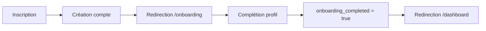
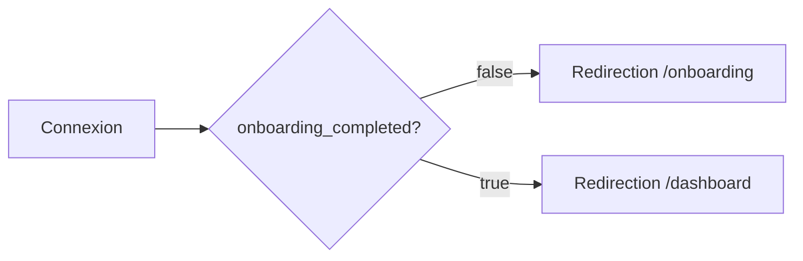

# Implémentation de la Redirection vers l'Onboarding

## 📋 Résumé

Mise en place d'une redirection intelligente vers `/onboarding` pour les nouveaux utilisateurs après inscription ou connexion, évitant le "flash" du dashboard et garantissant que tous les nouveaux utilisateurs complètent leur profil.

## 🎯 Objectifs

1. **Redirection immédiate** : Les nouveaux utilisateurs sont redirigés directement vers `/onboarding` sans passer par `/dashboard`
2. **Détection intelligente** : Le système détecte automatiquement si un utilisateur a complété son onboarding
3. **Flux fluide** : Utilisation de `router.push()` pour éviter les rechargements de page

## 🔧 Modifications Effectuées

### 1. Page d'Inscription (`/app/inscription/page.tsx`)

**Changements :**
- Suppression de `emailRedirectTo` dans les options de `signUp`
- Redirection immédiate vers `/onboarding` après création du compte
- Message adapté : "Compte créé ! Redirection vers votre espace..."

```typescript
// Après succès de signUp
router.push('/onboarding')
```

### 2. Page de Connexion (`/app/connexion/page.tsx`)

**Changements :**
- Vérification du profil après connexion réussie
- Redirection conditionnelle basée sur `onboarding_completed`

```typescript
// Vérifier le profil pour déterminer la redirection
const { data: profile } = await supabase
  .from('profiles')
  .select('full_name, onboarding_completed')
  .eq('id', data.user.id)
  .single()

if (!profile?.full_name || !profile?.onboarding_completed) {
  router.push('/onboarding')
} else {
  router.push(redirectTo)
}
```

### 3. Route API Callback (`/app/api/auth/callback/route.ts`)

**Changements :**
- Logique de redirection intelligente après échange de session
- Vérification du statut d'onboarding pour tous les flux d'authentification

```typescript
// Si le profil n'est pas complet ou nouveau
if (!profile?.full_name || !profile?.onboarding_completed) {
  return NextResponse.redirect(new URL('/onboarding', requestUrl.origin))
}
```

### 4. Middleware (`/middleware.ts`)

**Changements :**
- Ajout de `/onboarding` comme route semi-protégée
- Ajout des routes d'authentification dans les routes publiques
- Protection contre l'accès aux pages d'auth pour les utilisateurs connectés

```typescript
const semiProtectedRoutes = [
  '/onboarding',  // Nécessite auth mais pas de profil complet
]
```

### 5. Base de Données (`/scripts/add-onboarding-column.sql`)

**Nouveau script SQL :**
```sql
ALTER TABLE profiles 
ADD COLUMN IF NOT EXISTS onboarding_completed BOOLEAN DEFAULT false;

-- Marquer les profils existants comme ayant complété l'onboarding
UPDATE profiles 
SET onboarding_completed = true 
WHERE full_name IS NOT NULL AND full_name != '';
```

## 📊 Flux d'Authentification

### Nouvelle Inscription


### Connexion Utilisateur Existant


## ✅ Checklist de Vérification

- [x] Pas de "flash" du dashboard lors de l'inscription
- [x] Redirection directe vers `/onboarding` pour nouveaux utilisateurs
- [x] Détection automatique du statut d'onboarding
- [x] Middleware configuré correctement
- [x] Navigation fluide avec `router.push()`
- [x] Script SQL pour la colonne `onboarding_completed`

## 🚀 Prochaines Étapes

1. **Exécuter le script SQL** dans Supabase :
   ```bash
   psql -h [host] -U [user] -d [database] < scripts/add-onboarding-column.sql
   ```

2. **Vérifier la page `/onboarding`** :
   - S'assurer qu'elle met à jour `onboarding_completed = true` à la fin
   - Vérifier la redirection vers `/dashboard` après complétion

3. **Tester les flux** :
   - Nouvelle inscription → `/onboarding`
   - Connexion sans onboarding → `/onboarding`
   - Connexion avec onboarding → `/dashboard`

## 🔒 Sécurité

- Le middleware protège `/onboarding` : seuls les utilisateurs authentifiés y ont accès
- Les utilisateurs ne peuvent pas accéder au dashboard sans avoir complété l'onboarding
- Les utilisateurs connectés ne peuvent pas accéder aux pages d'inscription/connexion

## 📝 Notes Importantes

1. **Compatibilité** : Cette implémentation est compatible avec l'authentification par mot de passe (pas de Magic Links)
2. **Performance** : Utilisation de `router.push()` pour éviter les rechargements complets
3. **UX** : Messages clairs pour guider l'utilisateur tout au long du processus

---

*Date d'implémentation : 03/09/2025*
*Contexte : Migration complète vers authentification par mot de passe + onboarding obligatoire*
