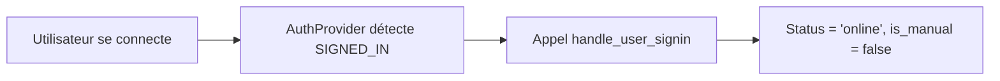
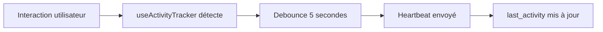
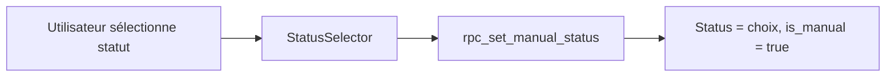
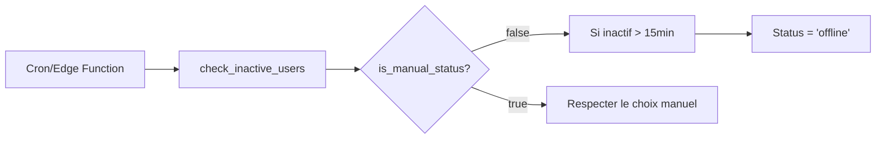

# 🟢 Système de Présence Automatique Aurora50 - Rapport d'Implémentation

## 📋 Vue d'ensemble

Le système de présence automatique a été implémenté avec succès pour Aurora50. Il gère automatiquement les statuts des utilisateurs (En ligne, Occupée, Ne pas déranger, Hors ligne) avec une priorité donnée aux choix manuels.

## ✅ Fonctionnalités Implémentées

### 1. **Base de Données (Supabase)**
- ✅ Nouvelles colonnes ajoutées à la table `profiles`:
  - `last_activity` (TIMESTAMPTZ) - Dernière activité détectée
  - `is_manual_status` (BOOLEAN) - Indique si le statut est manuel
  - `auto_offline_after` (INTEGER) - Minutes avant passage hors ligne (défaut: 15)
- ✅ Fonctions PostgreSQL créées:
  - `handle_user_signin()` - Gère la connexion
  - `handle_user_signout()` - Gère la déconnexion
  - `update_user_activity()` - Met à jour l'activité
  - `rpc_update_activity()` - RPC pour le heartbeat
  - `rpc_set_manual_status()` - RPC pour statut manuel
  - `check_inactive_users()` - Détecte les utilisateurs inactifs

### 2. **Frontend - Hooks et Composants**

#### `useActivityTracker` (lib/hooks/useActivityTracker.ts)
- 🔄 Envoie un heartbeat toutes les 30 secondes
- 👆 Détecte les interactions utilisateur (clics, mouvements, frappe)
- 📱 Gère les changements de visibilité de page
- 🪟 Détecte le focus/blur de la fenêtre
- 💾 Utilise `navigator.sendBeacon` pour la fermeture de page

#### `AuthProvider` (components/providers/AuthProvider.tsx)
- ✅ Statut "En ligne" automatique à la connexion
- ✅ Statut "Hors ligne" automatique à la déconnexion
- ✅ Appel des fonctions RPC Supabase appropriées

#### `StatusSelector` (components/ui/StatusSelector.tsx)
- ✅ Utilise `rpc_set_manual_status` pour les sélections manuelles
- ✅ Marque le statut comme manuel lors d'un choix utilisateur
- ✅ Interface responsive (mobile/desktop)

### 3. **Intégration dans l'Application**
- ✅ Hook `useAutoPresence` intégré dans le layout LMS
- ✅ Tracking actif sur toutes les pages de l'application
- ✅ Compatible avec le mode développement

## 🔄 Flux de Fonctionnement

### Connexion


### Activité Continue


### Sélection Manuelle


### Détection d'Inactivité


## 🎯 Comportements Clés

1. **Priorité du Manuel sur l'Automatique**
   - Un statut sélectionné manuellement reste actif jusqu'à:
     - Nouveau choix manuel
     - Déconnexion
     - Inactivité prolongée (2 heures)

2. **Détection d'Inactivité**
   - Par défaut: 15 minutes
   - Configurable par utilisateur
   - Ne s'applique qu'aux statuts automatiques

3. **Heartbeat Intelligent**
   - Throttle sur mousemove (1 seconde)
   - Debounce global (5 secondes)
   - Envoi immédiat au retour d'activité

## 📊 Performance et Optimisation

- **Indexes créés** pour optimiser les requêtes
- **Debounce/Throttle** pour limiter les requêtes
- **requestIdleCallback** compatible (si nécessaire)
- **Realtime Supabase** pour synchronisation instantanée

## 🚀 Déploiement

### 1. Exécuter les migrations SQL
```bash
# Dans Supabase SQL Editor
# 1. Exécuter scripts/add-presence-columns.sql
# 2. Exécuter scripts/create-inactive-check-function.sql (optionnel pour pg_cron)
```

### 2. Configuration pg_cron (Optionnel)
Si votre plan Supabase supporte pg_cron:
```sql
SELECT cron.schedule(
  'check-inactive-users',
  '* * * * *', -- Toutes les minutes
  $$ SELECT rpc_check_inactive_users(); $$
);
```

### 3. Alternative sans pg_cron
Créer une Edge Function qui appelle `rpc_trigger_inactive_check()` périodiquement, ou utiliser un service externe de cron.

## 🧪 Tests Recommandés

1. **Test de Connexion**
   - Se connecter → Vérifier statut "En ligne" automatique
   - Vérifier dans `/chat` que le statut est visible

2. **Test de Sélection Manuelle**
   - Sélectionner "Occupée" → Vérifier persistance
   - Attendre 15 min sans activité → Statut doit rester "Occupée"

3. **Test d'Inactivité**
   - Statut automatique "En ligne"
   - Ne pas interagir pendant 15 minutes
   - Vérifier passage à "Hors ligne"

4. **Test de Déconnexion**
   - Se déconnecter → Statut "Hors ligne" immédiat
   - Vérifier dans la base de données

5. **Test Multi-Onglets**
   - Ouvrir plusieurs onglets
   - Activité dans un onglet maintient le statut "En ligne"

## 🔧 Configuration Personnalisable

Les utilisateurs peuvent ajuster:
- `auto_offline_after`: Temps avant passage hors ligne (défaut: 15 minutes)

Les développeurs peuvent ajuster:
- `heartbeatInterval`: Fréquence du heartbeat (défaut: 30 secondes)
- `debounceDelay`: Délai de debounce (défaut: 5 secondes)

## 📝 Notes Importantes

1. **Mode Développement**: Le tracking est désactivé en mode dev (`NEXT_PUBLIC_USE_DEV_AUTH=true`)
2. **Sécurité**: Toutes les fonctions RPC utilisent `SECURITY DEFINER`
3. **Compatibilité**: Fonctionne sur tous les navigateurs modernes
4. **Mobile**: Gestion spéciale pour les événements touch

## 🌿 Philosophie "Cocon Digital"

Le système respecte la philosophie Aurora50:
- ✨ **Fluide**: Transitions douces entre statuts
- 🛡️ **Rassurant**: Respect des choix utilisateur
- 🎯 **Intuitif**: Comportement prévisible
- 💚 **Bienveillant**: Pas de tracking intrusif

## 📚 Fichiers Modifiés

- `/scripts/add-presence-columns.sql` - Migration base de données
- `/scripts/create-inactive-check-function.sql` - Fonctions de vérification
- `/lib/hooks/useActivityTracker.ts` - Hook de tracking d'activité
- `/components/providers/AuthProvider.tsx` - Gestion connexion/déconnexion
- `/components/ui/StatusSelector.tsx` - Sélecteur de statut manuel
- `/app/(lms)/layout.tsx` - Intégration du tracking

## ✨ Améliorations Futures Possibles

1. **Statuts Personnalisés**: Permettre aux utilisateurs de créer leurs propres statuts
2. **Historique de Présence**: Garder un log des changements de statut
3. **Analytics**: Dashboard de présence pour les administrateurs
4. **Notifications**: Alerter quand un contact change de statut
5. **Statut Programmé**: Définir des statuts à l'avance (ex: "En réunion de 14h à 15h")

---

*Implémentation réalisée le 03/09/2025 - Système de présence automatique Aurora50 v1.0* 🌟
